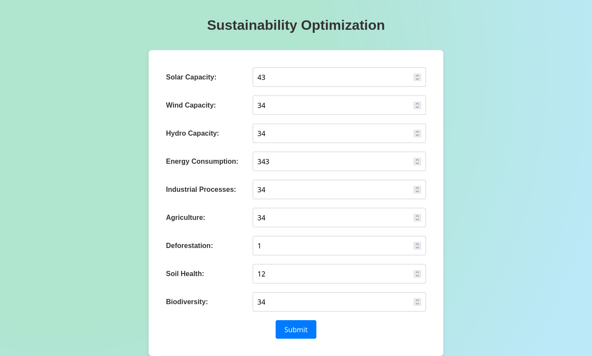
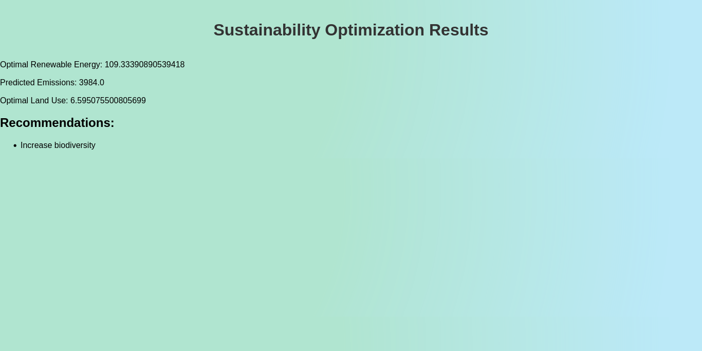

# EcoOptimize-Data-Driven-Climate-Solutions
 To combat climate change effectively, it is essential to develop data-driven solutions that optimize renewable energy usage, reduce greenhouse gas emissions, and implement sustainable land use practices.
</img>
</img>
